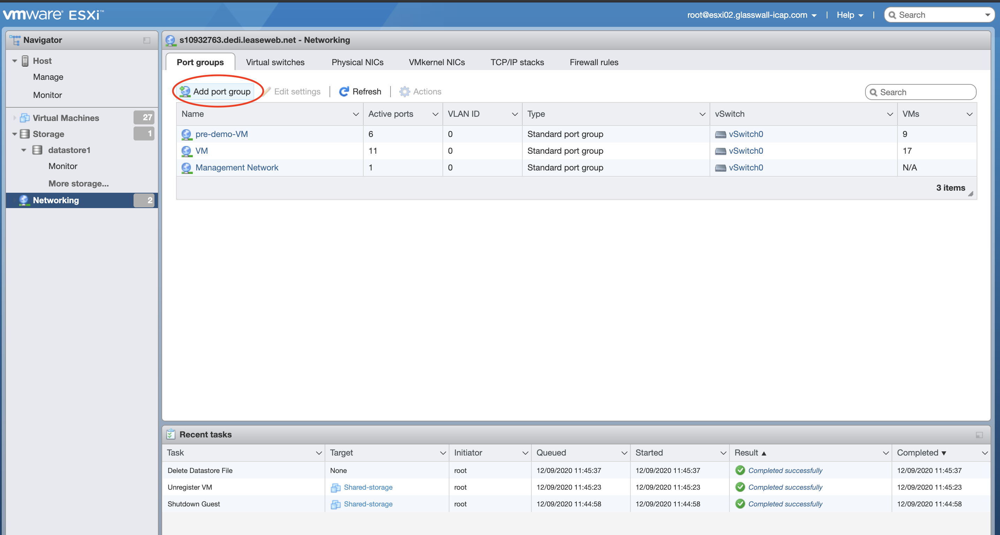
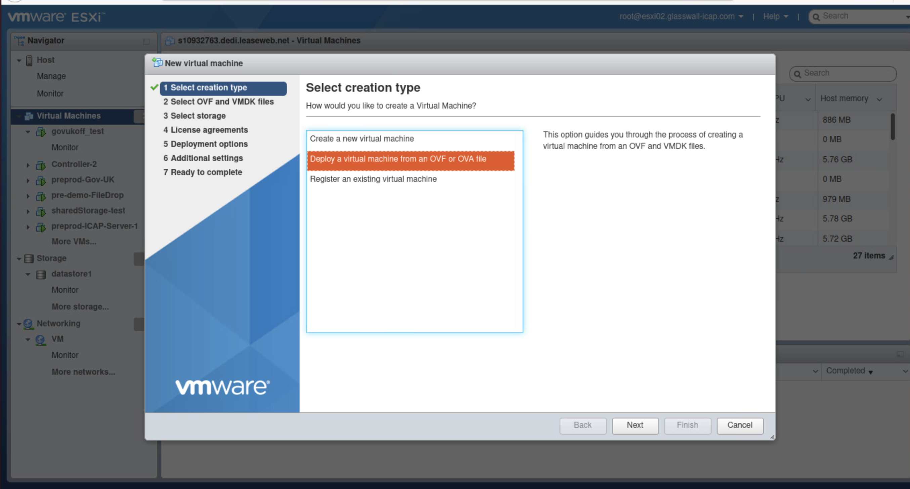
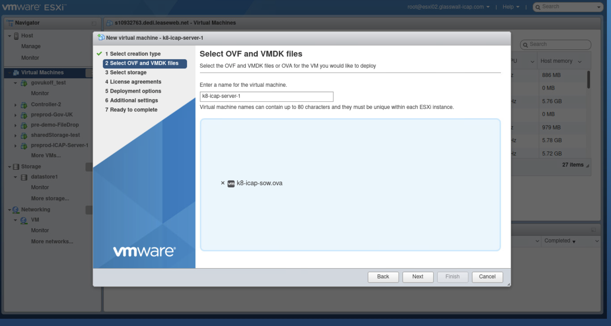
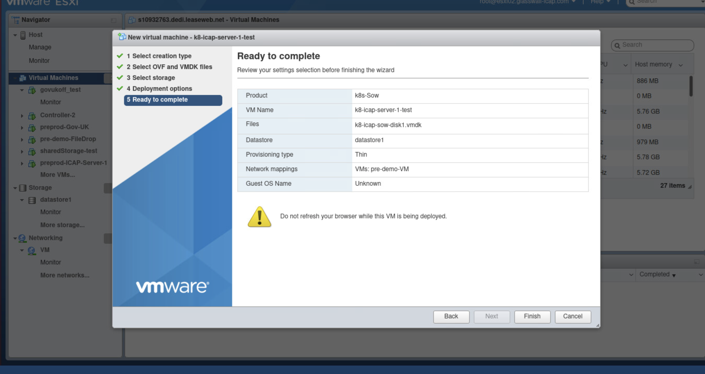
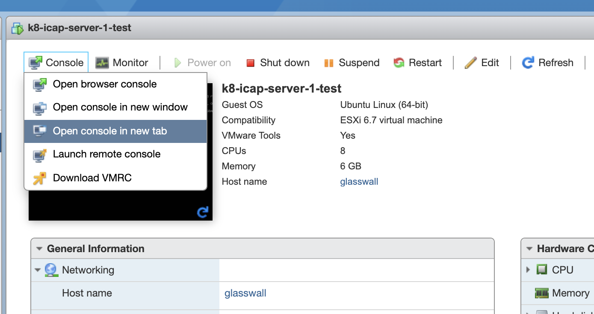
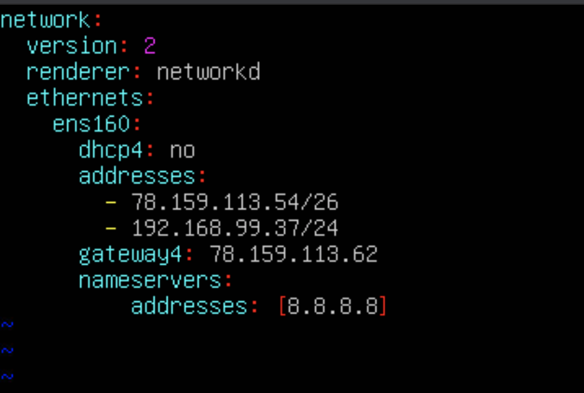

# ESXi VMware Setup instructions

This document contains Install instructions and demo walkthroughs for the Glasswall ICAP solution running on VMware.

### Pre-requisites

- ESXi 6.7 server with 150 GB or more Storage capacity
- Added 10 IP Addresses
- Internet access

### Part 1 (ICAP Server and Squid Proxy)

1. Download below 3 OVAs from https://github.com/k8-proxy/ESXI-setup-server/wiki
    - ICAP Server
    - Proxy Rebuild
    - File-drop
2. Login to ESXi 6.7 server
3. Create PortGroup Network called VM  

      
      
4. Deploy each OVAs in ESXI 6.7 Server
    
    1. “Create/Register VMs” from OVAS (using “Deploy a virtual machine from an OVF or OVA file)
    
        
        
    2.  Select "Deploy a virtual machine from an OVF or OVA file" 
        
            Give name for VM as shown in below table.
            Select respective OVA from below table in field "click to select files or drag/drop" and add downloaded OVA.
         
        | Name    | OVA |
        | :---: | :---: |
        | k8-icap-server-1 | k8-icap-sow.ova |
        | k8-proxy-server-1 | Proxy-Rebuild.ova |
        | file-drop | sow-rest.ova | 
        
         
         
    3. Click next until you get below screen and finally click Finish to deploy OVA in ESXI
    
         
    
    4. Repeat the same process for other 2 OVA to deploy itin ESXi VMware
        
5. Configure ICAP Server
    1. In ESXI,once file upload is completed,click on k8-icap-server-1 in list of VMs and open browser console for `k8-icap-server-1`
    
        
        
    2. You will be asked to login:
    
            glasswall login: glasswall
            password: glasswall
            
    3. Run 
    
            sudo vim /etc/netplan/01-netcfg.yml 
            
            (change IP and Gateway to an valid IP in the VM server)
            
            Below this IP is referenced as {IP of k8-icap-server-1}
            
         
                   
    4. Run:
            
            sudo netplan apply
    5. Run: 
            
            ping www.google.com  (to confirm that internet access is working)
            
    6. Run:
    
            sudo reboot now
            
    7. After reboot, login again with same credentials
    8. Run: 
            
            kubectl get pods -A —watch 
              
           (note: server will be operational when the adaptation-service is running ok)
           
6. Run ICAP client locally 

    1. Open local terminal window 
    2. Run:
    
            git clone https://github.com/k8-proxy/icap-client-docker.git
        
    3. Run: 
    
            cd icap-client-docker/
            sudo docker build -t c-icap-client .
                
    4. Run: 
           
            ./icap-client.sh {IP of k8-icap-server-1} JS_Siemens.pdf
            
            (check Respond Headers: HTTP/1.0 200 OK to verify rebuild is successful)
                  
    5. Run: 
    
            open rebuilt/rebuilt-file.pdf  
            
           (and notice "Glasswall Proccessed" watermark on the right hand side of the page)
            
    6. Open original `./JS_Siemens.pdf` file in Adobe reader and notice the Javascript and the embedded file 
    7. Open `https://file-drop.co.uk/` or `https://glasswall-desktop.com/` and drop both files (`./JS_Siemens.pdf ( original )` and `rebuilt/rebuilt-file.pdf (rebuilt) `) and compare the differences
     
7. Run multiple requests in parallel
    1. Run: 
    
            ./parallel-icap-requests.sh <ip of  k8-icap-server-1> 10 
           
           (it will start 10 docker containers, each making an ICAP request)
           
    2. Run below command to see local containers life cycle: 
 
           docker stats    
                                 
8. Configure Nginx/Squid proxy server 

    1. In ESXI, open browser console for `k8-proxy-server-1`
    
            username: glasswall
            password : Gl@$$wall
            
    2. Run 
    
            sudo vim /etc/netplan/00-installer-config.yaml 
            (change IP and Gateway to an valid IP in the VM server). Below this IP is referenced as <IP of k8-proxy-server-1>
            
    3. Run: 
    
            sudo netplan apply
    4. Run: `ping www.google.com` (to confirm that internet access is working)
    5. As glasswall user run: 
     
            cd /home/glasswall/s-k8-proxy-rebuild
            git stash
            git pull origin
            cd stable-src
            chmod +x setup.sh
            ./setup.sh {IP of k8-icap-server-1}
    
9. Configure local machine to use Proxy server
    1. Open local hosts file ( /etc/hosts on Linux and OSx , C:\Windows\System32\drivers\etc\hosts on Windows)
    2. Add these entries
    
        - {IP of k8-proxy-server-1}     glasswallsolutions.com
        - {IP of k8-proxy-server-1}     owasp.org
        - {IP of k8-proxy-server-1}     www.owasp.org
        
    3. Confirm DNS mappings are ok by running following (all should point to {IP of k8-proxy-server-1})
        - ping www.glasswallsolutions.com
        - ping owasp.org
        - ping www.owasp.org
        	 
10. Browser above websites protected by Glasswall SDK (via Glasswall ICAP server)

    1. Open `https://glasswallsolutions.com/` in browser
    
        1. Accept self signed cert (in Chrome this is done by clicking on ‘Advanced’ and then clicking on “Proceed to glasswallsolutions.com (unsafe)” 
        2. Click on the “Technology” link
        3. Click on “Download Brochure”
        4. Notice the “Glasswall Processed” watermark on the top right (used for demo purposes)
    
    2. Open https://owasp.org/ in browser
        1. Accept self-signed cert
        2. Click on Projects (opens drop down menu)
        3. Click on ‘Owasp Top Ten’
        4. Click on ‘Download’ (right-hand side menu in the “Downloads or Social Links” section)
        5. Notice the “Glasswall Processed” watermark on the top right 
        6. Back on the OWASP website, type “pdf” on the search bar (drop right)
        7. Click on the 3rd link called “PDF Archive Files” (which is this page https://owasp.org/www-pdf-archive/ )
        8. Click on any of those files (for example the first one is https://owasp.org/www-pdf-archive//(Almost)_everything_about_passwords_that_OWASP_OWASPGbg_20140218_Per_Thorsheim.pdf)
        9. Notice the “Glasswall Processed” watermark and how this complex file was correctly rebuilt

### Part 2 (Seeing ICAP Kubernetes pods in action)

1. Start watching k8 (Kubernetes) pods events
    - In ESXi, open browser console for k8-icap-server-1 
        - Or ssh into vm using: ssh glasswall@{ip of  k8-icap-server-1}   (accept the ECDSA key fingerprint)
    - Run : kubectl get pods -A --watch
    - Keep this window open
2. Generate traffic
    - Open Terminal where https://github.com/k8-proxy/icap-client-docker.git was cloned
    - Run:  ./icap-client.sh {ip of  k8-icap-server-1} 
3. See multiple status of the pod created to process the file sent by the ./icap-client.sh tool (one pod per file processed)

NAMESPACE         NAME                                           				     READY   STATUS      		RESTARTS   AGE
icap-adaptation   rebuild-2bcbfe8b-c6d4-46d4-bc89-400d582f7a96   0/1     Pending     		0          0s
icap-adaptation   rebuild-2bcbfe8b-c6d4-46d4-bc89-400d582f7a96   0/1     Pending     		0          0s
icap-adaptation   rebuild-2bcbfe8b-c6d4-46d4-bc89-400d582f7a96   0/1     ContainerCreating   0          0s
icap-adaptation   rebuild-2bcbfe8b-c6d4-46d4-bc89-400d582f7a96   0/1     ContainerCreating   0          1s
icap-adaptation   rebuild-2bcbfe8b-c6d4-46d4-bc89-400d582f7a96   1/1     Running             		0          1s
icap-adaptation   rebuild-2bcbfe8b-c6d4-46d4-bc89-400d582f7a96   0/1     Completed           	0          5s

4. Send multiple requests 
    1. Run: ./parallel-icap-requests.sh {ip of  k8-icap-server-1}  10
    2. See the multiple events in the k8-icap-server-1 console
5. Generate web traffic and see file being processed
    - Run: ./icap-client-docker % curl https://owasp.org/www-pdf-archive/OWASP_Top_10-2017_%28en%29.pdf.pdf --insecure
        - See pod events in k8-icap-server-1
    - Browse www.glasswallsolutions.com or owasp.org websites (with the local dns changes made to the hosts file) and open any pdf
        - See pod events in k8-icap-server-1  (one pod per file processed)

6. Install octant tool to see more details about kubernetes setup (for more details about Octant see https://octant.dev/ and https://github.com/vmware-tanzu/octant)
    - In k8-icap-server-1 console 
    - Run: wget https://github.com/vmware-tanzu/octant/releases/download/v0.16.2/octant_0.16.2_Linux-64bit.deb
    - Run: sudo dpkg -i octant_0.16.2_Linux-64bit.deb
    - Exit console
    - Run: ssh -L 7777:127.0.0.1:7777 glasswall@78.159.113.49
    - Run: octant
    - Open in browser: http://localhost:7777/#/ 

7. Use Octant UI:
    - Chose icap-adaptation from the Namespaces drop down menu (top menu, in the middle)
        - http://localhost:7777/#/workloads/namespace/icap-adaptation
    - Click on events 
        - http://localhost:7777/#/overview/namespace/icap-adaptation/events
    - (Generate some traffic using ./icap-client.sh or ./parallel-icap-requests.sh tools)
    - Click on one of the rebuild-* pods (in the Kind column), and notice
        - Summary ( for example: Pod Conditions, Environment variables, Volume Mounts, Events)
        - Resource Viewer (Graph of resources used)
        - Yaml (of Pod)
        - Logs (from inside the pod, notice the Glasswall events):

			OutcomeSender Connection established to rabbitmq-service
			TransactionEventSender Connection established to rabbitmq-service
			Sent Transaction Event, FileId: 356cc355-832c-4ee9-92f4-b1134af0e64c, EventId: NewDocument
			Using Glasswall Version: 1.61.34205
			FileId: 356cc355-832c-4ee9-92f4-b1134af0e64c, Filetype Detected: Pdf
			Sent Transaction Event, FileId: 356cc355-832c-4ee9-92f4-b1134af0e64c, EventId: FileTypeDetected
			Sent Transaction Event, FileId: 356cc355-832c-4ee9-92f4-b1134af0e64c, EventId: AnalysisCompleted
			Sent Transaction Event, FileId: 356cc355-832c-4ee9-92f4-b1134af0e64c, EventId: RebuildStarted
			FileId: 356cc355-832c-4ee9-92f4-b1134af0e64c, successfully rebuilt.
			Sent Transaction Event, FileId: 356cc355-832c-4ee9-92f4-b1134af0e64c, EventId: RebuildCompleted
			Sent Message, ReplyTo: amq.rabbitmq.reply-to.g1hkACByYWJiaXRAcmFiYml0bXEtY29udHJvbGxlci12NmdqcAAADW4AAAAAX8nTxQ==.HY5rFxz+Z2C2J8B69FZ+TQ==, FileId: 356cc355-832c-4ee9-92f4-b1134af0e64c, Outcome: replace

		- Terminal (not available because pod is long gone) 
			- to open an terminal into an running pod, try the rabbitmq-controller
				(available from http://localhost:7777/#/overview/namespace/icap-adaptation/workloads/pods)
    - On the left navigation, click on Workloads and then Pods
        - http://localhost:7777/#/overview/namespace/icap-adaptation/workloads/jobs
        - Run: ./parallel-icap-requests.sh {ip of  k8-icap-server-1}  20         (which will make 20 requests to the server)
        - Click on the ‘Age’ column to show the most recent pods at the top (they should appear when starting the Glasswall Rebuild process and disappear when completed)
	- explore other parts of the UI to get more details about the setup and configuration of the Glasswall ICAP solution

### Part 3) Scale up and Load balancers

1. Create VMs for Load balancers
    -  Download these 2 OVAs from https://github.com/k8-proxy/ESXI-setup-server/wiki
        - HAProxy-ICAP OVA
        - HAProxy-Web OVA 
    - In ESXi “Create/Register VMs” from OVAS 
        - For the HAProxy-ICAP.ova name the VM load-balancer-icap 
        - For the HAProxy-Web.ova name the VM load-balancer-web
2. Setup Load Balancer for the ICAP Server
    - In ESXi open the console of load-balancer-icap and login (glasswall:Gl@$$wall)
    - Run sudo vim /etc/netplan/00-installer-config.yaml (change IP and Gateway to an valid IP in the VM server) . Below this IP is referenced as {IP of k8-proxy-server-1}
    - Run: sudo netplan apply
    - Run: ping www.google.com   (to confirm that internet access is working)
    - Run: sudo vim /etc/haproxy/haproxy.cfg
    - Look for the two sections that start with #Backend nodes are those by witch HAProxy can forward requests
        - There are two entries in there
        - Delete one
        - Replace the IP for the {k8-icap-server-1}
    - Note that this change need to be done in two places 
        - once for the 1344 traffic (clear text)
        - once for the 1345 traffic (tls traffic)
    - Save the changes
    - Run: sudo systemctl restart haproxy.service 
        - To confirm setup:
            - Run: telnet localhost 1344
            - Press enter a couple times
            - Output should be

				Trying 127.0.0.1...
				Connected to localhost.
				Escape character is '^]'.
                

				ICAP/1.0 400 Bad request
				Server: C-ICAP/0.5.6
				Connection: close

				Connection closed by foreign host.
    - To see the traffic being processed by the Load Balancer in realtime 
        - Run: tail -f /var/log/haproxy.log
    - Open Terminal where https://github.com/k8-proxy/icap-client-docker.git was cloned
    - Run:  ./icap-client.sh {ip of  load-balancer-icap} 
        - This should result in a rebuild file locally 
        - One entry should had appeared in the HAProxy logs (showing the IP address fo the request and the ICAP server that was used to process the request, in the current case since there is only one ICAP server configured, the entry should say pool/icap01 )
    - Run: ./parallel-icap-requests.sh {ip of  load-balancer-icap}  20
        - To send 20 requests to the load balancer (all should be going to pool/icap01)
3. Clone k8-icap-server-1
    - In ESXi, open the console for the k8-icap-server-1, login
    - Run: sudo shutdown now
    - In ESXi, click on the “Storage” left-hand side menu item
        - click on “datastore1”
        - click on “Datastore browser” 
        - click on “Create directory”
        - Call the directory “_icap_servers”
        - Select “_icap_servers” and click on “Create directory” 5 times using 
            - Server-1
            - Server-2
            - Server-3
            - Server-4
            - Server-5
        - Click on the k8-icap-server-1
            - Click “copy”
            - Chose the “_icap_servers/server-1” as target directory
            - Click “copy”
        - (Do the same steps above to copy k8-icap-server-1 into the other 4 server directories)
    - Close “Database Browser”
    - Click on “Virtual Machines” (left hand side menu)
    - Look at the ‘Recent Tasks” section for the execution of the Copy
    - Once copy is completed:
        - Click on “Virtual Machines”
        - Click on “Create/Register VM”
        - Chose “Register an existing virtual machine” , click “Next”
        - Click “Select one or more virtual machines, a datastore or a directory”
        - Chose the “_icap_server” directory that has the 5 servers
        - The 5 VMs should show in the table
        - Click next
        - Click finish
        - In the VM list, click on the 2nd instance of “k8-icap-server-1”
            - Click on “Edit”
            - Click on VM Options
            - Rename it to k8-icap-server-2
            - (Do the same for the other VMs: Note, when in the Edit view, take expand the ‘Hard-Disk 1’ row to see what is the name of the file in the datastore)
        - Click on ‘Power on’
            - In the pop up option chose “I Copied It” 
            - Click Answer

		- Next step is to assign the new IPs
		- Finally add these new IPs to the load-balancer-icap

5. Setup Load Balancer for Web Proxy
    - In ESXi open the console of load-balancer-web and login (glasswall:Gl@$$wall)
    - Run sudo vim /etc/netplan/00-installer-config.yaml (change IP and Gateway to an valid IP in the VM server) . Below this IP is referenced as {IP of k8-proxy-server-1}
    - Run: sudo netplan apply
    - Run: ping www.google.com   (to confirm that internet access is working)
    - Run: sudo vim /etc/haproxy/haproxy.cfg
    - Look for the one sections that starts with #Backend nodes are those by witch HAProxy can forward requests
        - Replace the IP for the {k8-icap-proxy-1}
        - This is for the web01 entry
        - Save changes
    - Run: sudo systemctl restart haproxy.service 
    - To see the traffic being processed by the Load Balancer in realtime 
        - Run: tail -f /var/log/haproxy.log
    - In local test machine
        - Open local hosts file (in OSx it is: sudo vim /etc/hosts )
        - Change these entries to now point to the {load-balancer-web} IP address

    - {IP of load-balancer-web}      glasswallsolutions.com
    - {IP of load-balancer-web}      owasp.org
    - {IP of load-balancer-web}      www.owasp.org


### Part 4) File Drop

1. Download 3 OVAs from https://github.com/k8-proxy/ESXI-setup-server/wiki
    - File-Drop 
2. Setup File Drop
    - In ESXi, open browser console for sow-rest (user:secret)
    - Run: passwd user    (to a stronger password)
    - Run sudo vim /etc/netplan/00-installer-config.yaml (change IP and Gateway to an valid IP in the VM server)
        - Replace the value: 
           network:
             version: 2
               renderer: networkd
			ethernets:
				eth0:
					dhcp4: yes 
        - With (note that this is an yaml file so that layout/spaces is import)
			ethernets:
				eth0:
					addresses:
					- {IP address of file-drop}
					gateway4: {gateway of server}
					nameservers:
						addresses:
						- 8.8.8.8
    
    - Run: `sudo netplan apply`    
    - Run: ping www.google.com   (to confirm that internet access is working)	
    - Run: `sudo systemctl restart k3s`
    - After reboot open https://{IP address of file-drop}
        - Click on Login (no password for now)
        - Drop a file in the drop zone
        - Download the Protected file 
        - Click on the ‘Refresh button’
        - Drop the protected file
        - See the difference between both files

 	
| [Previous Page](https://github.com/k8-proxy/ESXI-setup-server/wiki)  | [Next Page](https://github.com/k8-proxy/ESXI-setup-server/wiki/Videos-For-OVAs) |
| :--        |         --: |	